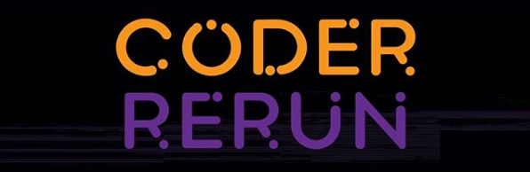

# Evento Coder Rerun
Códigos feitos durante o evento Coder Rerun 2020 promovida pelo ramo estudantil IEEE - UEL 

Realizado dia 03 de outrubro das 14h até 18:30, pela plataforma URI disponível em: https://www.urionlinejudge.com.br/judge/en/challenges/contest/533

### <a href="https://www.ieeeuel.org/coderrerun">Clique aqui para mais informações sobre evento</a>

# Problemas
- [X] Jogo Dos Copos		
- [ ]	Magic and Sword		
- [ ] Christmas Gifts		
- [X]	Web Browser		
- [ ]	The Problem of 7 x 1		
- [ ]	Demogorgon	
- [ ]	The Bad Vibes Walk		
- [X]	Pyramid		
- [ ]	Oh no, a Black Hole!		
- [X] The Game	
- [ ]	Help Nhonho		
- [ ]	Brainfuck		
- [ ]	Maratona Brasileira de Comedores de Pipocas		
- [ ]	File Retrieval
